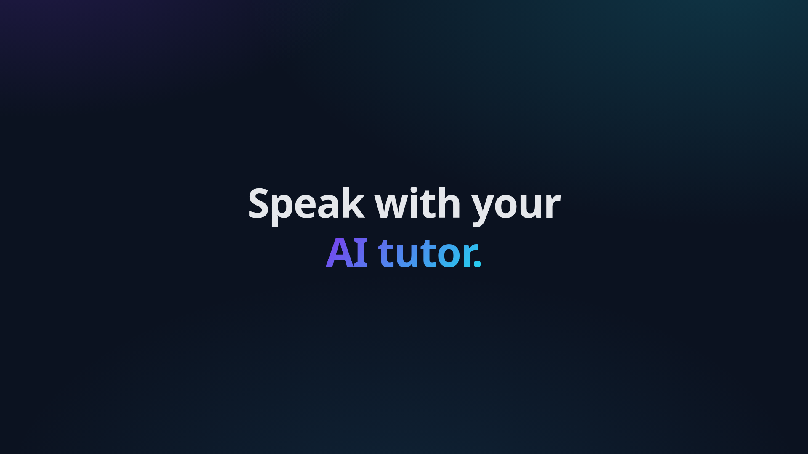
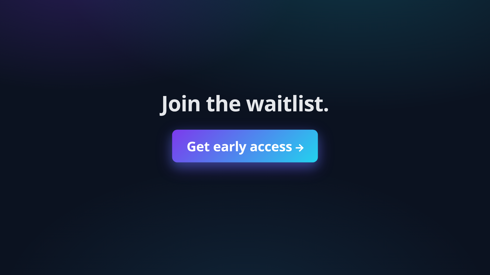

# Tutoriq Remotion Video

Programmatically generated promo videos for [Tutoriq](https://tutoriq.app), built with [Remotion](https://www.remotion.dev/).

## Preview

| Tagline scene | CTA scene |
|---|---|
|  |  |

Rendered MP4 samples live in [`samples/`](./samples) — `tutoriq-promo.mp4` (1920×1080) and `tutoriq-promo-vertical.mp4` (1080×1920).

## Compositions

- **TutoriqPromo** — 1920×1080 landscape (12s @ 30fps)
- **TutoriqPromoVertical** — 1080×1920 vertical for TikTok / Reels / Shorts (12s @ 30fps)

## Scenes

1. **Logo** (0–2s) — animated TQ badge + wordmark
2. **Tagline** (2–4.5s) — "Speak with your AI tutor."
3. **Languages** (4.5–7s) — Arabic · French · English pills
4. **Features** (7–9.5s) — natural conversations, quizzes, made for adults
5. **CTA** (9.5–12s) — "Join the waitlist" + tutoriq.app

## Develop

```bash
cd remotion
npm install
npm start          # opens Remotion Studio in the browser
```

## Render

```bash
npm run build              # renders landscape MP4 → out/tutoriq-promo.mp4
npm run build:vertical     # renders vertical MP4 → out/tutoriq-promo-vertical.mp4
```

Outputs land in `remotion/out/` (gitignored).

## Customize

- Brand colors and gradients live in `src/theme.ts` (kept in sync with the landing-page CSS variables).
- Each scene is a self-contained component in `src/scenes/`, composed by `src/TutoriqPromo.tsx`.
- Scene durations are configured at the top of `src/TutoriqPromo.tsx`.
